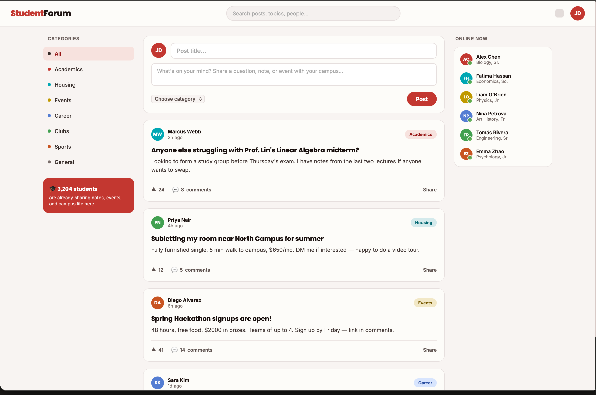
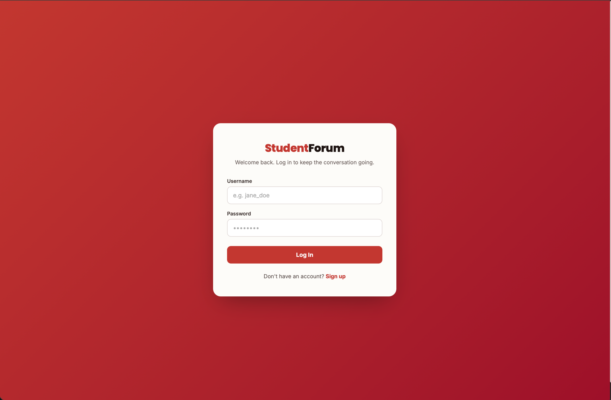
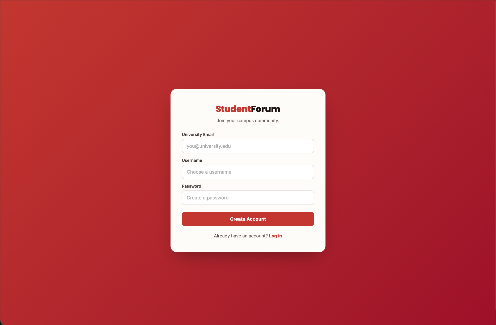
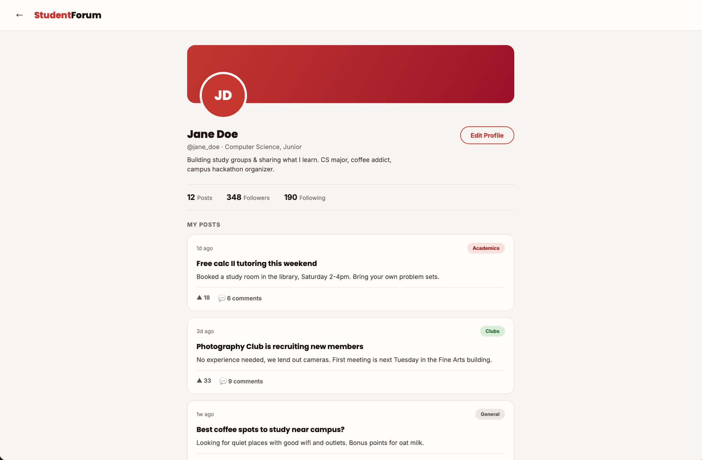

<div align="center">

# StudentForum

A full-stack forum application where university students can create posts, join discussions, discover other students, and manage their profiles.

**Spring Boot · React · Spring Security · Elasticsearch · H2**

> StudentForum is an actively developed portfolio project demonstrating full-stack development, REST API design, authentication, search, and frontend-backend integration.

</div>

<p align="center">
  
</p>

## About the project

StudentForum is a campus-oriented discussion platform designed to help university students connect around academic topics, events, housing, career opportunities, clubs, and everyday campus life.

Users can create an account, authenticate securely, publish posts, comment on discussions, search for other students, and manage their profiles.

The project is organized as a monorepo containing a Spring Boot backend and a React frontend.

## Features

### Authentication and account management

- User registration with input validation
- Secure password hashing with BCrypt
- JWT-based stateless authentication
- JWT storage in an `HttpOnly` cookie
- Login and logout
- Protected frontend routes
- View, update, and delete the current account
- Username and email uniqueness validation

### Posts and comments

- Create and browse posts
- View individual post details
- Paginated post feeds
- View posts published by a specific user
- Delete posts owned by the authenticated user
- Create comments on posts
- Paginated comment lists
- Delete comments owned by the authenticated user

### Profiles and search

- Public student profiles
- Display of username, major, and published posts
- Profile editing
- Prefix-based user search
- Elasticsearch-backed user indexing
- Debounced search interface

### API and validation

- REST API built with Spring Boot
- Request validation with Jakarta Validation
- Centralized exception handling
- Consistent error responses
- Interactive Swagger UI
- OpenAPI documentation
- Spring Data pagination

## Screenshots

<table>
  <tr>
    <td width="50%">
      
    </td>
    <td width="50%">
      
    </td>
  </tr>
  <tr>
    <td align="center"><strong>Login</strong></td>
    <td align="center"><strong>Registration</strong></td>
  </tr>
</table>

<p align="center">
  
</p>

## Technology stack

### Backend

| Technology | Purpose |
|---|---|
| Java 17 | Backend programming language |
| Spring Boot 4 | Application framework |
| Spring Web MVC | REST API |
| Spring Security | Authentication and authorization |
| Spring Data JPA | Database access |
| Spring Data Elasticsearch | User search |
| JWT | Stateless authentication |
| BCrypt | Password hashing |
| H2 | Local file-based database |
| Jakarta Validation | Request validation |
| Springdoc OpenAPI | Swagger and API documentation |
| Maven | Dependency and build management |
| Lombok | Boilerplate reduction |

### Frontend

| Technology | Purpose |
|---|---|
| React 18 | User interface |
| Vite 5 | Development and production build |
| React Router | Client-side routing |
| Zustand | Authentication state |
| Axios | API communication |
| Tailwind CSS | Responsive styling |
| Lucide React | Icons |

### Infrastructure

| Technology | Purpose |
|---|---|
| Docker Compose | Local Elasticsearch setup |
| Elasticsearch 9 | User indexing and prefix search |
| Git and GitHub | Version control and project management |

## Project structure

```text
StudentForum/
├── backend/
│   ├── src/main/java/studentforum/backend/
│   │   ├── configuration/    # Security and application configuration
│   │   ├── controller/       # REST controllers
│   │   ├── dto/              # Request and response objects
│   │   ├── exception/        # Exceptions and global error handling
│   │   ├── model/            # JPA entities
│   │   ├── repository/       # JPA repositories
│   │   ├── search/           # Elasticsearch integration
│   │   └── service/          # Business logic
│   ├── src/main/resources/
│   └── pom.xml
├── frontend/
│   ├── src/
│   │   ├── api/              # Backend API functions
│   │   ├── components/       # Reusable UI components
│   │   ├── constants/        # Categories and majors
│   │   ├── pages/            # Route-level pages
│   │   ├── store/            # Zustand state
│   │   └── utils/            # UI and error helpers
│   ├── package.json
│   └── vite.config.js
├── docs/
│   ├── images/
│   └── api-docs.yaml
├── docker-compose.yml
└── README.md
```

## Requirements

The following tools are required to run the project locally:

- Java Development Kit 17
- Node.js 18 or newer
- npm
- Docker Desktop or Docker Engine with Docker Compose
- Git

A separate Maven installation is not required because Maven Wrapper is included in the project.

## Running the project

### 1. Clone the repository

```bash
git clone https://github.com/YOUR_USERNAME/student-forum.git
cd student-forum
```

Replace `YOUR_USERNAME` with the GitHub account that owns the repository.

### 2. Configure the backend

Create the backend environment file from the project root:

```bash
cp backend/.env.example backend/.env
```

Open `backend/.env` and provide the following variables:

```env
JWT_SECRET=YOUR_BASE64_ENCODED_SECRET
JWT_EXPIRATION=86400000
```

`JWT_EXPIRATION` is expressed in milliseconds. The example value represents 24 hours.

A suitable Base64-encoded JWT secret can be generated with:

```bash
openssl rand -base64 32
```

Never commit the real `.env` file or production credentials.

### 3. Configure the frontend

Create the frontend environment file from the project root:

```bash
cp frontend/.env.example frontend/.env
```

The frontend environment file contains:

```env
VITE_API_BASE_URL=http://localhost:8080
```

### 4. Start Elasticsearch

Run Docker Compose from the project root:

```bash
docker compose up -d
```

Elasticsearch will be available at:

```text
http://localhost:9200
```

Elasticsearch must be running before registering users or using the user search feature.

### 5. Start the backend

```bash
cd backend
./mvnw spring-boot:run
```

On Windows:

```powershell
cd backend
mvnw.cmd spring-boot:run
```

The backend will be available at:

```text
http://localhost:8080
```

### 6. Start the frontend

Open another terminal from the project root:

```bash
cd frontend
npm install
npm run dev
```

The application will be available at:

```text
http://localhost:5173
```

## Development services

| Service | URL |
|---|---|
| Frontend | `http://localhost:5173` |
| Backend API | `http://localhost:8080` |
| Swagger UI | `http://localhost:8080/swagger-ui` |
| OpenAPI JSON | `http://localhost:8080/sw-api/api-docs` |
| H2 Console | `http://localhost:8080/h2-console` |
| Elasticsearch | `http://localhost:9200` |

H2 development connection settings:

```text
JDBC URL: jdbc:h2:file:./data/mydb
Username: sa
Password: empty
```

The H2 database is intended for local development. Generated database files are not committed to the repository.

## Validation rules

Registration applies the following rules:

- Email must use a valid email format.
- Username must contain only English letters and numbers.
- Username must be between 3 and 20 characters.
- Password must be between 6 and 64 characters.
- Password must contain an uppercase letter, lowercase letter, number, and special character.
- Major is required.

Posts and comments are also validated before persistence.

## Security notes

- Passwords are hashed with BCrypt using strength 12.
- JWTs are stored in an `HttpOnly` cookie.
- The backend uses stateless Spring Security configuration.
- Post and comment deletion is restricted to the resource owner.
- JWT secrets and local environment files are excluded from Git.
- Development cookies currently use `secure=false`.
- Production deployment should enable secure cookies and HTTPS.
- H2 Console and development CORS settings should be disabled or restricted in production.

## Development approach

The backend architecture, REST API design, security, persistence, validation, and search integration were implemented by me.

The frontend was developed through AI-assisted collaboration with Claude Code, based on the API contract and project requirements defined for StudentForum. Frontend changes are reviewed and integrated as part of the full-stack development workflow.

## Contributing

This is currently a personal portfolio project. Suggestions and bug reports can be submitted through GitHub Issues.

When contributing:

1. Create an issue describing the proposed change.
2. Create a branch from `main`.
3. Keep commits focused and descriptive.
4. Open a pull request explaining the implementation.

---

<div align="center">

Built as a portfolio project to explore secure full-stack application development.

</div>
